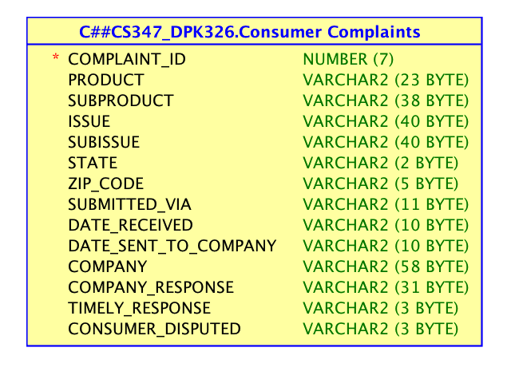
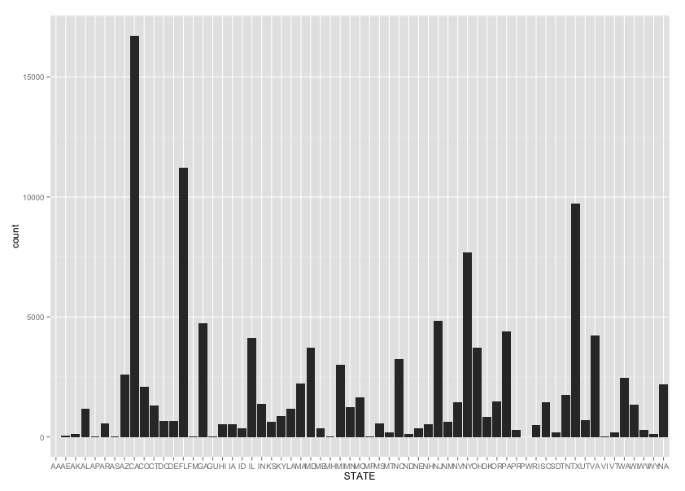
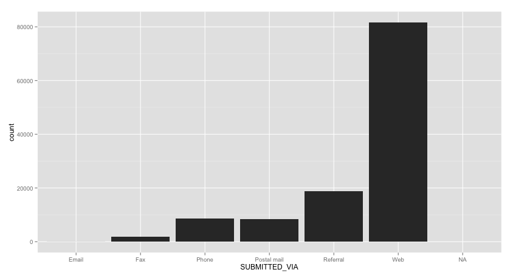
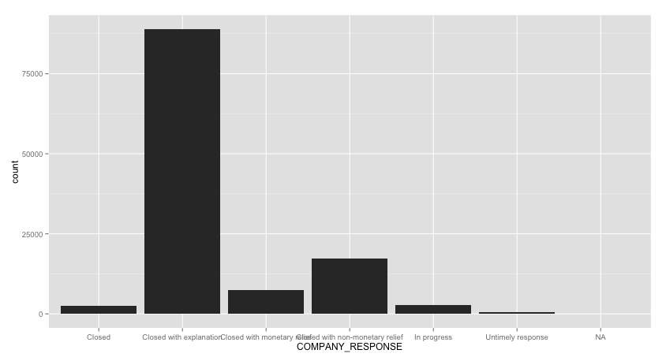

Consumer Complaints
---
Title: "Consumer Complaints Data Analysis: Project 1, 2, and 3"

Author: "Anesh Patel, David Ko, Ann Abraham"

Date: "December 5, 2014"
---
**Our GitHub repo to clone:** 

      https://github.com/annrushmi/CS378-Data-Science-.git
  
==================

**Our data set is based on a collection of data based on consumer complaints from Bank companies over a 2 week period from 8/28/2013-9/10/2013. Our data includes state, zip code, complaint description and complaint ID, the method of submitted complaint, company name, date and date received by company and the company's response and whether or not if it was responded to in a timely fashion.**


###This is our we configured our R Studio
```{r}
sessionInfo()
```
###This is our Rpofile configuration
```
Consumer_Complaints <- read.csv("~/Desktop/Consumer_Complaints.csv")
View(Consumer_Complaints)
library("ggplot2", lib.loc="/Library/Frameworks/R.framework/Versions/3.0/Resources/library")
library("RJDBC", lib.loc="/Library/Frameworks/R.framework/Versions/3.0/Resources/library")
library("knitr", lib.loc="/Library/Frameworks/R.framework/Versions/3.0/Resources/library")
```

###Basic R Language Constructs
```{r}
source("../01 Basic R/Basic.R", echo = TRUE)
```

###This is our logical model from Data Modeler


###Consumer Complaint Data by State
```ggplot(data = MYTABLE) + geom_histogram(aes(x = STATE))```


###Consumer Complaint Data by Products
```ggplot(data = MYTABLE) + geom_histogram(aes(x = PRODUCT))```


###Consumer Complaint Data by Submitted Via
```ggplot(data = MYTABLE) + geom_histogram(aes(x = SUBITTED_VIA))```


###Consumer Complaint Data by Company Response
```ggplot(data = MYTABLE) + geom_histogram(aes(x = COMPANY_RESPONSE))```


###Our UI.r 
```{r}
#Here is our code for the UI.r:
# ui.R

#shinyUI(fluidPage(
#  titlePanel("Consumer Complaints"),
  
#  sidebarLayout(
#    sidebarPanel(
#      helpText("Create demographic maps with 
#        information from the 2010 US Census."),

#     selectInput("var", 
#                  label = "Choose a variable to display",
#                  choices = c("Submitted Via", "Zip Code"),
#                  selected = "Percent"),
      
#      sliderInput("range",
#                  label = "Range of interest:",
#                  min = 0, max = 100, value = c(0, 100))
#    ),
    
#    mainPanel(plotOutput("map"))
#  )
#))

```

###Our Server.R
```{r}
#Here is our code for the Server.R
#server.R

#library(maps)
#library(mapproj)
#counties <- read.csv(data/cc.csv, header = TRUE, sep = ",", quote = "\"",
#                     dec = ".", fill = TRUE, comment.char = "#", ...)
#source("helpers.R")


#shinyServer(
#  function(input, output) {
#    output$map <- renderPlot({
#      args <- switch(input$var,
#                     "Submitted Via" = list(counties$white, "darkgreen", "% White"),
#                     "ZipCode" = list(counties$black, "black", "% Black"),
#      args$min <- input$range[1]
#      args$max <- input$range[2]
      
#      do.call(percent_map, args)
#    })
#  }
#)

```

###Our Shiny!
```{r}
#Here is a screen shot of our Shiny App
```


###Project 3
**Findings of Interest:**

  - Debt collection complaints appear most often when submitted via web.
  
  - When complaints are submitted via referral, mortgage complaints are  
    substantially the highest.
    
  - Debt collection complaints concern unfair or hostile communication.
  
  - Mortgage complaints concern confusion over logistical issues.
